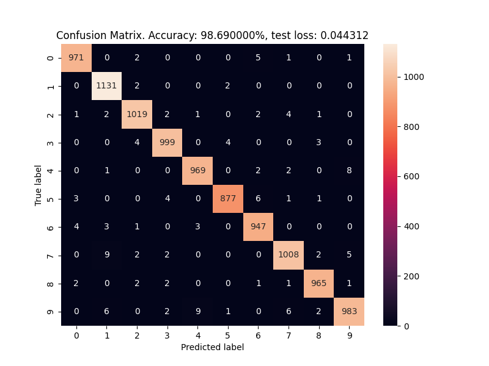
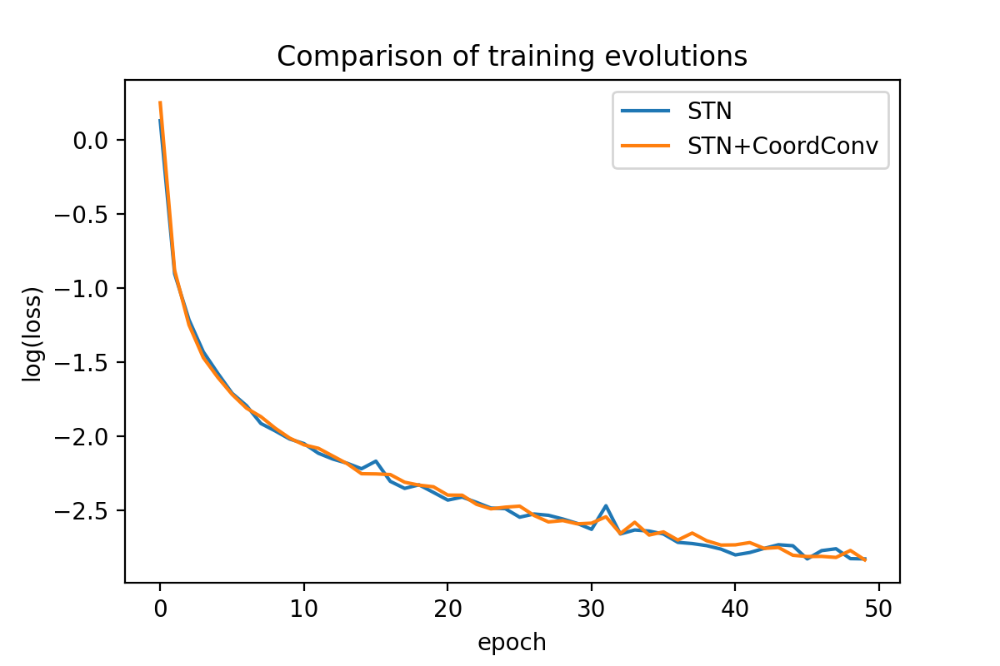
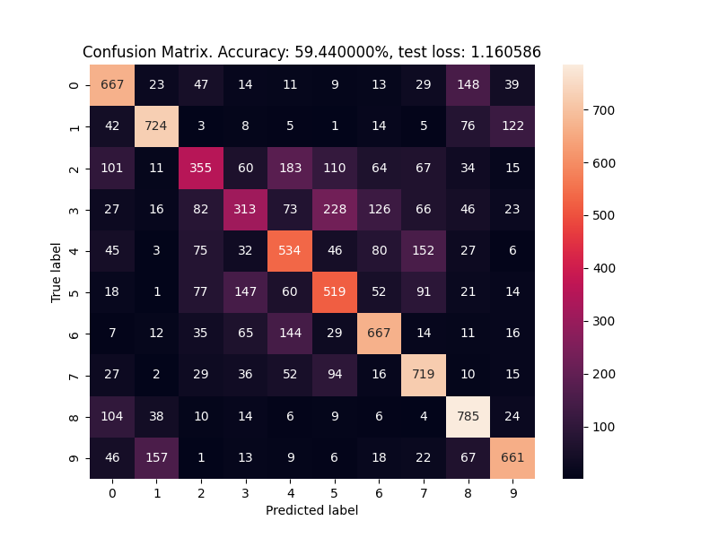

# Spatial Transformer Networks
This repository is built to explore Spatial Transformer Networks and some added features that may enhance their performance.

## Setup
### Requirements
Linux/macOS system with `python3`, `pip` and `git`.

### Instructions
1. Clone the repository locally
2. `cd` into the repository
3. `python3 -m venv venv`
4. `source venv/bin/activate`
5. `pip install --upgrade pip`
6. `pip install -r requirements.txt`
## Usage
To reproduce the 3 experiments performed in the following report, run the bash script `run_experiments.sh` from the root of the project:
```
./run_experiments.sh
```
Make sure that it has executable permissions.

For running a particular custom experiment, configure the config.yaml file with the parameters of your liking and run from the project's root
```
python run_eval_model.py
```
Any parameter value can be altered from the default directly from the teminal, for example:
```
python run_eval_model.py model.coordconv=true
```

Also, for performing a training on the CIFAR10 dataset instead of the default MNIST, run the dollowing:
```
python run_eval_model.py +data=cifar10
```

In all cases, results ara stored in the directory `outputs`, in subdirectories named after the date and time of each run. For each run, a log file can also be found named `run_eval_model.log`, as well as the configuration used for the run in the `.hydra` subdirectory.
 
## Results and discussion
We evaluated the performance of the a standard Spatial Transformer Network by training and evaluating it on the MNIST handwritten digits dataset (http://yann.lecun.com/exdb/mnist/). The training was performed for 50 epochs using the Adam optimizer with a learning rate of 0.01. The mini-batch size chosen was 64. The chosen loss function was log-likelihood, however as the network's last layer is a log-softmax, we are actually computing the categorical crossentropy.

We used categorical crossentropy as a metric to evaluate classification strength in a precise manner, as it computes the likeness of the predicted probability distribution over the 10 different digit classes with respect to the target (correct) distribution. 
In addition to using categorical crossentropy, we computed the overall accuracy on the test set as a rough estimate of performance, which is more intuitive. 
We also generated a cunfusion matrix over the test set to view graphically the classification strength. 
The following figure contains the three aforementioned metrics:

### Addition of CordConv
As a second experiment, we implemented CoordConv layers and used them in place of the usual convolution layers. They differentiate from ordinary convolutions by incorporating coordinate information of the input pixels, be it the input image or the intermediate feature maps. After performing an analogous training process to the stantard STN, we obtained the following metrics:

We observe a slight improvement in accuracy, but a 15% reduction in test loss. We hypothesize that including coordinate information in the convolutional layers helps recover information from the original input image after the (possibly severe) deformations performed by the spatial transformer.

In the following figure one can compare the evolution of the training loss for both model architectures:


The evolution of training loss is very similar, even when plotting the log of the loss values. This indicates that the model with CoordConv achieves better generalization on the test set.

In order to obtain a confirmation of this performance improvement, we performed the same set of trainings on the CIFAR10 dataset (batch size 32) (https://www.cs.toronto.edu/~kriz/cifar.html), obtaining similar results, but with a more moderate 2% improvement on test loss. For reference, the following metrics were obtained using CoordConv: 

The significantly lower accuracy attained is likely due to the higher difficulty of the dataset and the reduced number of epochs (50), in addition to the simple baseline architecture.

### Further experiments
The reference implementation of STN uses affine transformations for the spatial transformer. However, as mentioned in the paper, other types of transformations could theoretically be employed. We wanted to explore if the addition of a different, more suitable transformation, could improve performance. 
Inspired by the analysis performed in [4], we implemened affine diffeomorphic transformations, which are affine transformations that are differentiable and have differentiable inverse, which equates to mappings that conserve the original image's topology, in the sense that no kinks, or tears are introduced. In theory, this would smooth out the gradient computations and would prohibit transformations that eliminate some image's information in an irrecoverable manner.

After training the STN on the MNIST dataset with the affine diffeomorphic transformer, instead of the affine one, with the same training parameters, we obtain the following:

The results again show an improvement with respect to the baseline model, an even more significant improvement in fact, with over 25% reduction in testing loss. The confusion matrix also shows high sensitivity and specificity for the ten classes.

We have thus hinted at the potential for improvement in performance of STNs by designing more suitable tets of transformations.


## References
1. Theoretical basis for STN: https://arxiv.org/abs/1506.02025
2. Base implementation of STN: https://pytorch.org/tutorials/intermediate/spatial_transformer_tutorial.html
3. Theoratical basis for CoordConv layers and Tensorflow Implementation: https://arxiv.org/abs/1807.03247
4. Idea for diffeomorphic affine transformations: https://www2.compute.dtu.dk/~sohau/papers/cvpr2018/detlefsen_cvpr_2018.pdf
